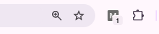
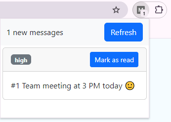

# My Messages

Chrome Extension for fetching and displaying company-wide messages

## Install instructions

### Install dependencies

```
npm i
```

### Build the extension

```
npm run build
```

\* if you are in development mode you can run

```
npm run watch
```

for automatic rebuilding after change

### Add to Chrome

1. From the Chrome menu select Extensions -> Manage Extensions
2. Enable developer mode (in the top right corner)
3. Click on the Load Unpacked button
4. Navigate to `<project-directory>/dist`
5. Click Select folder
6. After the extension is loaded, a new icon should appear in the list of extensions (puzzle icon on the right of the address bar)

The extension should look like this:




After clicking on the button, a popup with a list of messages appears:




## Test

The project contains a few tests written with React test library and vitest. The command for running tests is:

```
npm run test
```

## Future improvements

- implement real API and Admin panel😀
- implement websockets to show messages in realtime
- implement user authentication 
  - storing read messages on the backend (works on different devices)
  - admins can send more direct messages by role, department, or directly to the user by id
  - more message types where the user can vote, respond, RVSP...
- use notification API to show the message
- optimize state updates (update state only if there are new messages)
    - update the api only to return new messages (store last call time locally)